# CSCE 435 Group project

## 0. Group number: 8

## 1. Group members:
1. Alex Do
2. Alex Byrd
3. Jose Rojo
4. Matthew Livesay

## 1.1 Communication:
We will be communicating using an iMessage group chat. This has been created already and all members have responded.

## 2. Project topic (e.g., parallel sorting algorithms)
The project includes parallelizing sequential sorting algorithms that include bitonic sort, sample sort, merge sort, and radix sort. After parallelizing the algorithms, we will examine their performance by varying the number of input sizes, the number of processors involved in the operation, and how the initial input array is generated.

### 2a. Brief project description (what algorithms will you be comparing and on what architectures)

- Bitonic Sort (Alex Do): Bitonic Sort is a divide-and-conquer algorithm that operates by constructing a sequence of elements that forms a bitonic sequence, which is basically a sequence that first increases and then decreases. The algorithm then recursively sorts this bitonic sequence by performing compare-exchange operations to produce a sorted sequence. When bitonic sort is parallelized, the core operations of comparing and exchanging elements are distributed across multiple processors.
  
- Sample Sort (Alex Byrd): The Parallel Sample Sort algorithm distributes data across multiple processes, where each process (including the master) sorts its chunk concurrently using some sequential sorting method (in this case, quicksort). After sorting, processes send samples to the master, which selects splitters and broadcasts them. Each process splits its sorted chunk into buckets based on the splitters, exchanges buckets with other processes, and sorts them locally. The final sorted data is then gathered and merged, efficiently balancing computation and communication across all processes.
  
- Merge Sort (Jose Rojo): Merge sort is a divide-and-conquer sorting algorithm that recursively splits an array into two halves, sorts each half, and then merges the sorted halves back together. The process continues until the array is split into individual elements, which are inherently sorted. Then, during the merging phase, the sorted subarrays are combined to produce a fully sorted array.
  
- Radix Sort (Matthew Livesay): Radix sort works by sorting an array from LSB to MSB. A group of bits is taken into account and then the entire array is sorted to make the considered bits ordered from smallest to largest. By the time the algorithm has completed sorting the MSBs, the entire array will be sorted.

### 2b. Pseudocode for each parallel algorithm
- For MPI programs, include MPI calls you will use to coordinate between processes

#### Bitonic Sort

```
function ParallelBitonicSort()
    Initialize MPI w/ MPI_Init()
    Get rank and size w/ MPI_Comm_rank() and MPI_Comm_size()

    total_elements = Get from user input and verify it's 2^n
    elements_per_process = total_elements / size

    // Scattering input array
    if rank == 0
        global_array = initialize_array(total_elements)
    else
        global_array = None

    local_array = Allocate array of size elements_per_process
    Scatter portions of the global array from the root process w/ MPI_Scatter()

    // Main bitonic sort loop
    for k = 2 to total_elements by multiplying by 2
        for j = k // 2 down to 1 by dividing by 2

            // Determine sorting direction
            if (rank & (k // 2)) == 0
            ascending = true
            else
            ascending = false

            // Calculate partner process
            partner = rank XOR j

            if partner < size
            // Perform exchange and merge
            CompareExchange(local_array, partner, ascending)

    Gather data from all processes and assembles it into a single array on the root process w/ MPI.Gather()

    Finalize MPI w/ MPI.Finalize()

// Helper functions during bitonic sort
function compareExchange(int local_array[], int partner, bool ascending)
    if rank < partner
        Send local_array to partner
        Receive partner_array from partner
    else
        Receive partner_array from partner
        Send local_array to partner

    combined_array = Merge(local_array, partner_array, ascending)

    // Determine which half to keep
    if ( (rank < partner and ascending) or (rank > partner and not ascending) )
        local_array = first half of combined_array 
    else
        local_array = second half of combined_array

function merge(int array1[], int array2[], bool ascending)
    merged_array = array1 + array2
    Sort merged_array in ascending or descending order based on 'ascending' flag
    return merged_array

```

#### Radix Sort
```
each processor starts with a portion of the array to be sorted (will likely generate it)

for each chunck of bits
    iterate over entire portion of array to generate a histogram

    send histogram to all other processes
    receive histograms from all other processes using mpi_reduce or similar

    combine all histograms (this might be acomplished by the mpi call that collects all histograms)
    calculate prefix sum array using histogram array

    calculate processor offset using mpi_rank
    combine offset and prefix sum array to find final offset for each value in array portion

    use MPI call to place each value in a global data structure 

```


#### Merge Sort
```
 // Master process
        for i = 1 to array_size - 1
            Use MPI Send to even amount of data to all worker processes

        for i = 1 to size - 1
            Use MPI Recieve to get sorted arrays from worker processes
        call "merge" function to merge sorted arrays

// Worker processes
        Use MPI_recv to recieve arrays from master process
        call "sequentialMergeSort" function to sort recieved array
        Use MPI_send sorted arrays back to the master process

//Sequential Merge Sort
  function mergeSort(array A, int left, int right)
    if (left < right)  // Check if the array has more than one element
        int mid = (left + right) / 2

        // Sort the left half
        mergeSort(A, left, mid)

        // Sort the right half
        mergeSort(A, mid + 1, right)

        // Merge the sorted halves
        merge(A, left, mid, right)
end function

function merge(array A, int left, int mid, int right)
    // Create temporary arrays to hold the left and right halves
    int leftArray[mid - left + 1]
    int rightArray[right - mid]

    // Copy data to temporary arrays
    for i = 0 to mid - left
        leftArray[i] = A[left + i]
    for j = 0 to right - mid - 1
        rightArray[j] = A[mid + 1 + j]

    // Merge the temporary arrays back into A
    int i = 0, j = 0, k = left
    while (i < size of leftArray and j < size of rightArray)
        if (leftArray[i] <= rightArray[j])
            A[k] = leftArray[i]
            i++
        else
            A[k] = rightArray[j]
            j++
        k++

    // Copy remaining elements of leftArray, if any
    while (i < size of leftArray)
        A[k] = leftArray[i]
        i++
        k++

    // Copy remaining elements of rightArray, if any
    while (j < size of rightArray)
        A[k] = rightArray[j]
        j++
        k++
end function

```

#### Sample Sort
```
Initialize MPI (MPI_init, MPI_Comm size & rank)

Note: The master process basically has the worker process tasks weaved into it, as it only does additional computations
when the workers are done. If we didn't treat the master process as an additional worker process, we would lose a good amount of performance.

// Master process
        for (worker processes)
            Use MPI_Send to even amount of data to all worker processes
        
        Sort the master's chunk

        MPI Gather the samples from each processor
        Sort samples (use quicksort here, only master process)
        Select (m-1) splitters
        MPI Broadcast splitters to all processors

        Split the chunk into buckets based on splitters

        Gather sorted buckets from all processes
        for (worker processes)
            recv data for each process

        Merge the sorted buckets


// Worker processes
        Use MPI_recv to recieve arrays from master process
        Sort the chunks (use quicksort here, per process)
        Gather sampled elements back to the master
        Recv splitters from master
        Split the chunk into buckets based on splitters
        Send the corresponding buckets back 
```

The Parallel Sample Sort algorithm distributes data across multiple processes, 
where each process (including the master) sorts its chunk concurrently using some
sequential sorting method (in this case, quicksort). After sorting, processes send
samples to the master, which selects splitters and broadcasts them. Each process
splits its sorted chunk into buckets based on the splitters, exchanges buckets with
other processes, and sorts them locally. The final sorted data is then gathered
and merged, efficiently balancing computation and communication across all processes.

### 2c. Evaluation plan - what and how will you measure and compare
- Input sizes, Input types  
    - The input array sizes will always be 2^N, and therefore of length 2^16, 2^18, 2^20, 2^22, 2^24, 2^26, 2^28
    - These input array types will be either sorted, random, reverse sorted, or 1% perturbed
    - All values in the input arrays will be integers
- Strong scaling (same problem size, increase number of processors/nodes)
    - We will analyze how the sorting algorithms scale when increasing the number of processors while keeping the problem size constant, allowing us to determine how well an algorithm can take advantage of additional computational resources for the same problem. That is, the execution time should decrease as more processors are added.
    - Therefore, we will compare the execution time of the parallel sorting algorithms with varying processor counts (2, 4, 8, 16, 32, 64, 128, 256, 512, 1024) for each input array size
- Weak scaling (increase problem size, increase number of processors)
    - We will evaluate the performance when both the problem size and the number of processors increase proportionally, allowing us to determine if the algorithm can handle larger problems as more resources (processors) are added. That is, the algorithm should be maintaining a constant execution time as the processors and problem size scale together
    - Therefore, we will compare the execution time of the parallel sorting algorithms with increasing array sizes (2^16, 2^18, 2^20, 2^22, 2^24, 2^26, 2^28) with corresponding increasing processor counts (2, 4, 8, 16, 32, 64, 128, 256, 512, 1024)


### 3a. Caliper instrumentation

### Sample Sort
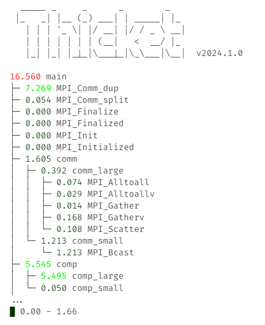

### Merge Sort
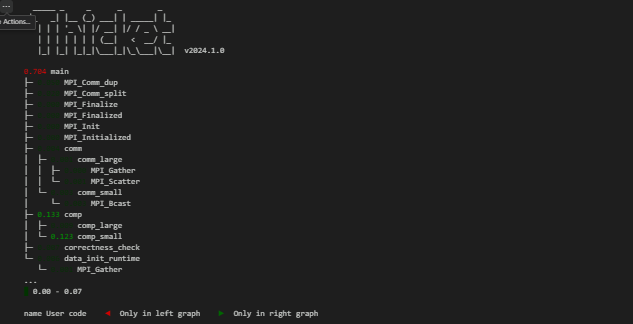

### Bitonic Sort
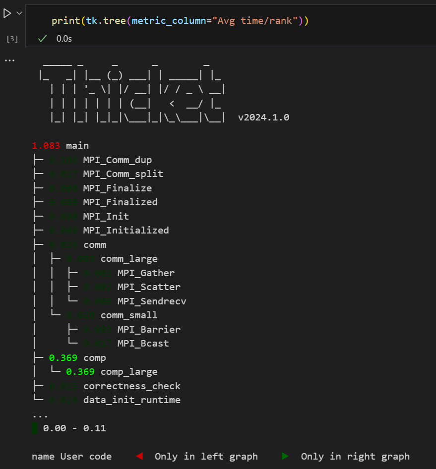

### Radix Sort
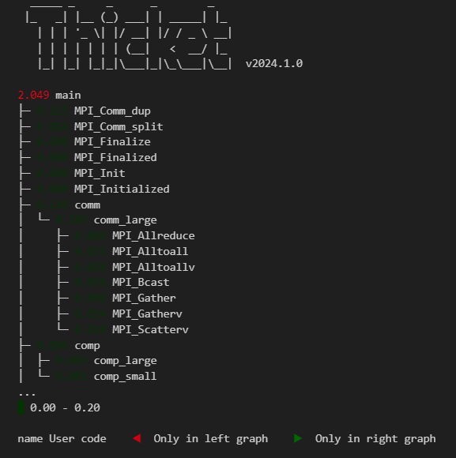


### 3b. Collect Metadata

#### Sample Sort
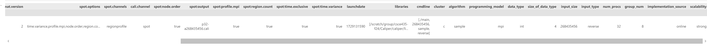

#### Merge Sort


#### Bitonic Sort


#### Radix Sort
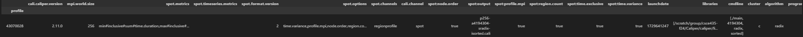


## 4. Performance evaluation

Include detailed analysis of computation performance, communication performance. 
Include figures and explanation of your analysis.

### 4a. Vary the following parameters
For input_size's:
- 2^16, 2^18, 2^20, 2^22, 2^24, 2^26, 2^28

For input_type's:
- Sorted, Random, Reverse sorted, 1%perturbed

MPI: num_procs:
- 2, 4, 8, 16, 32, 64, 128, 256, 512, 1024

This should result in 4x7x10=280 Caliper files for your MPI experiments.

### 4b. Hints for performance analysis

To automate running a set of experiments, parameterize your program.

- input_type: "Sorted" could generate a sorted input to pass into your algorithms
- algorithm: You can have a switch statement that calls the different algorithms and sets the Adiak variables accordingly
- num_procs: How many MPI ranks you are using

When your program works with these parameters, you can write a shell script 
that will run a for loop over the parameters above (e.g., on 64 processors, 
perform runs that invoke algorithm2 for Sorted, ReverseSorted, and Random data).  

### 4c. You should measure the following performance metrics
- `Time`
    - Min time/rank
    - Max time/rank
    - Avg time/rank
    - Total time
    - Variance time/rank

### Bitonic Sort
### DISCLAIMER: All plots with full metrics are available in Images/Bitonic/ \

Note: I kept getting Hydra memory issues for 1024 runs, so they weren't included in the following graphs. 

Average speedup on main
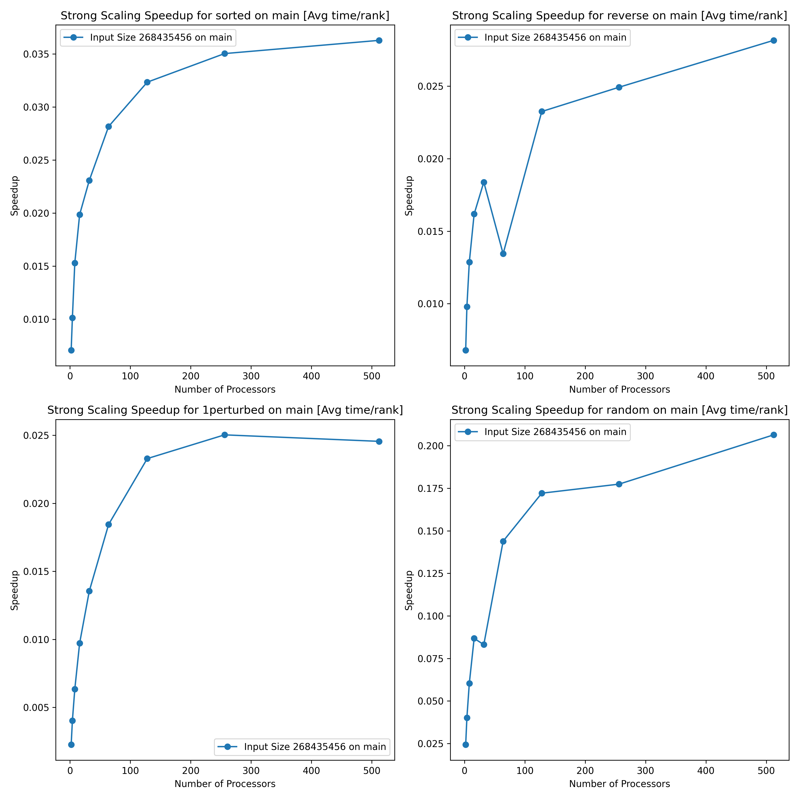

Average speedup on comm
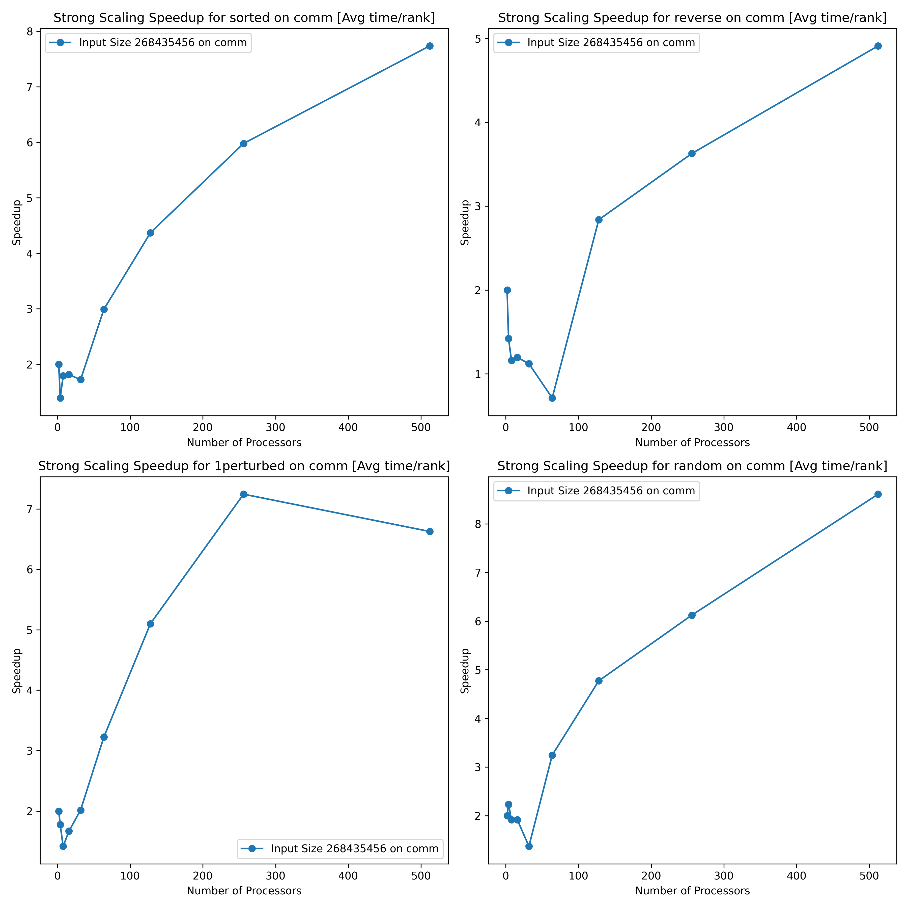

Average speedup on comp
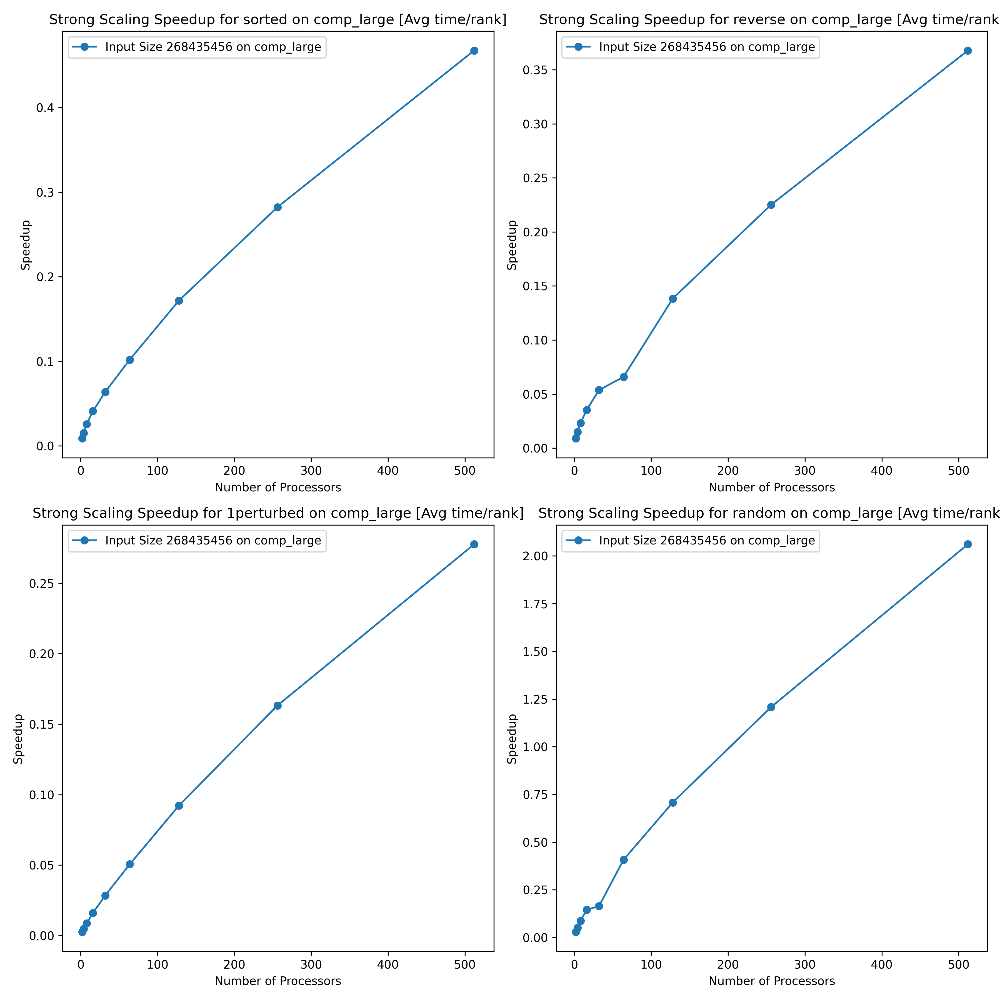

Random input overall shows significantly higher speedup than the other input types: sorted/reverse/1perturbed. This suggests the overall program is limited by both computation and communication overhead, which makes sense because random input likely benefits most from parallelization as work is more evenly distributed. As a result, it shows that communication patterns are highly dependent on input type, and that speedup is bounded by the communication overhead since the curves initially show modest speedup but then level off quickly at higher processor counts.

Average Strong scaling on main


Average Strong scaling on comm


Average Strong scaling on comp


Regarding the main node, the scaling behavior shows initial performance improvement around lower processor counts, but after that, adding more processors provides diminishing returns or even hurts performance. Regarding the communication node, the performance is less predictable compared to other nodes and it's relatively erratic, suggesting communication overhead is becoming a bottleneck since bitonic sort requires significant communication between processors. Regarding the large computation node, it similarly shows rapid initial performance improvement that eventually levels off. Overall, the diminishing returns with increasing processor count is following Amdahl's Law behavior in the main and large computation node. The spikes and irregularities in performance, like in the communication node, suggest load balancing issues since Grace was heavily utilized during runs due to long queue times.

Average Weak scaling on main


Average Weak scaling on comm


Average Weak scaling on comp


In weak scaling, the goal is to maintain the workload per processor constant as the problem size and the number of processors increases proportionally. The average time per processor should remain constant if the algorithm scales perfectly, but the algorithm doesn't demonstrate ideal weak scaling, which would be a horizontal constant line. In all four input types, the average time per process increases steadily as the number of processors increases, suggesting that there is some overhead or inefficiency scaling with the number of processors. After the sharp rise, the scaling curve becomes more gradual but continues to increase. The increasing execution time with more processors, despite keeping the problem size per processor constant, indicates the communication overhead is becoming dominant because bitonic sort requires O(logN) parallel steps, so the communication becomes more complex as more processors are added. Even though each processor has to deal with the same 'n' elements in weak scaling, each processor must participate in more communication rounds as the system gets larger and the number of communication rounds increases logarithmically with P.

### Merge Sort
### DISCLAIMER: All plots with full metrics are available in Images/mergesort_plots/ \
### For my analysis, I chose to analyze the max time across all plots due to the professors recommendation during lecture. 

### Strong Scaling Speedup

Max speedup on comm
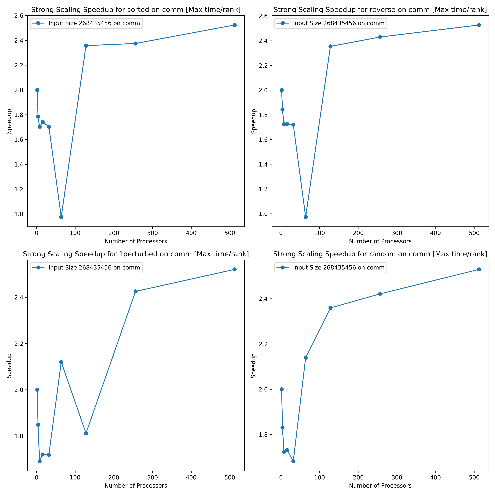

Max speedup on comp
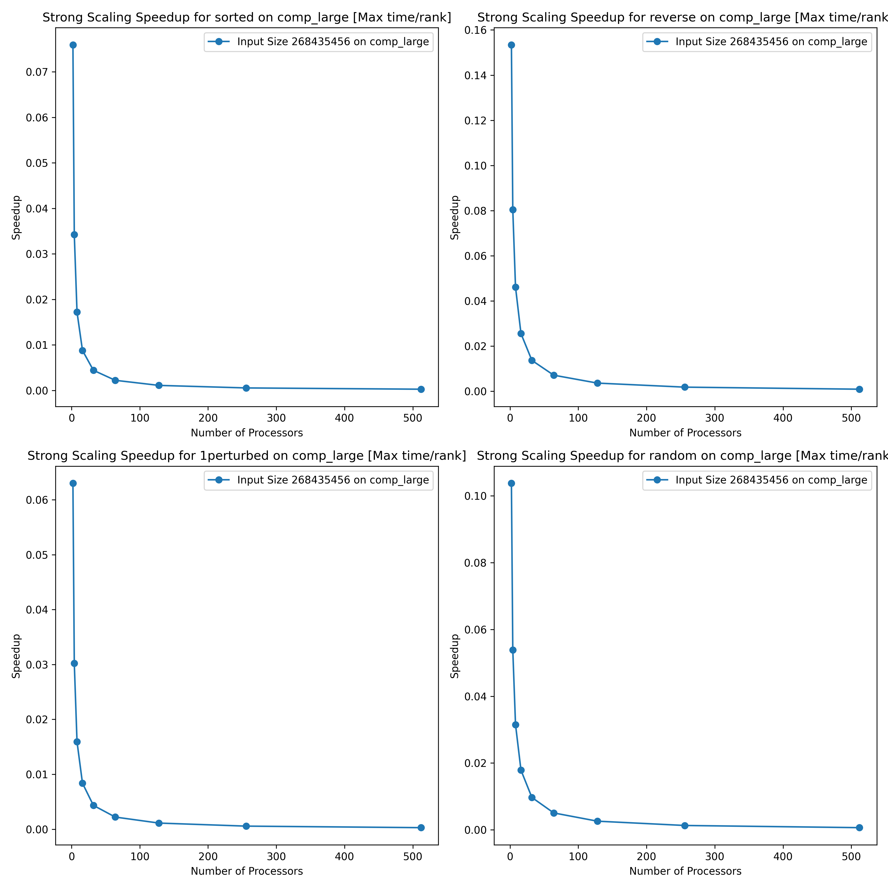

Max speedup on main
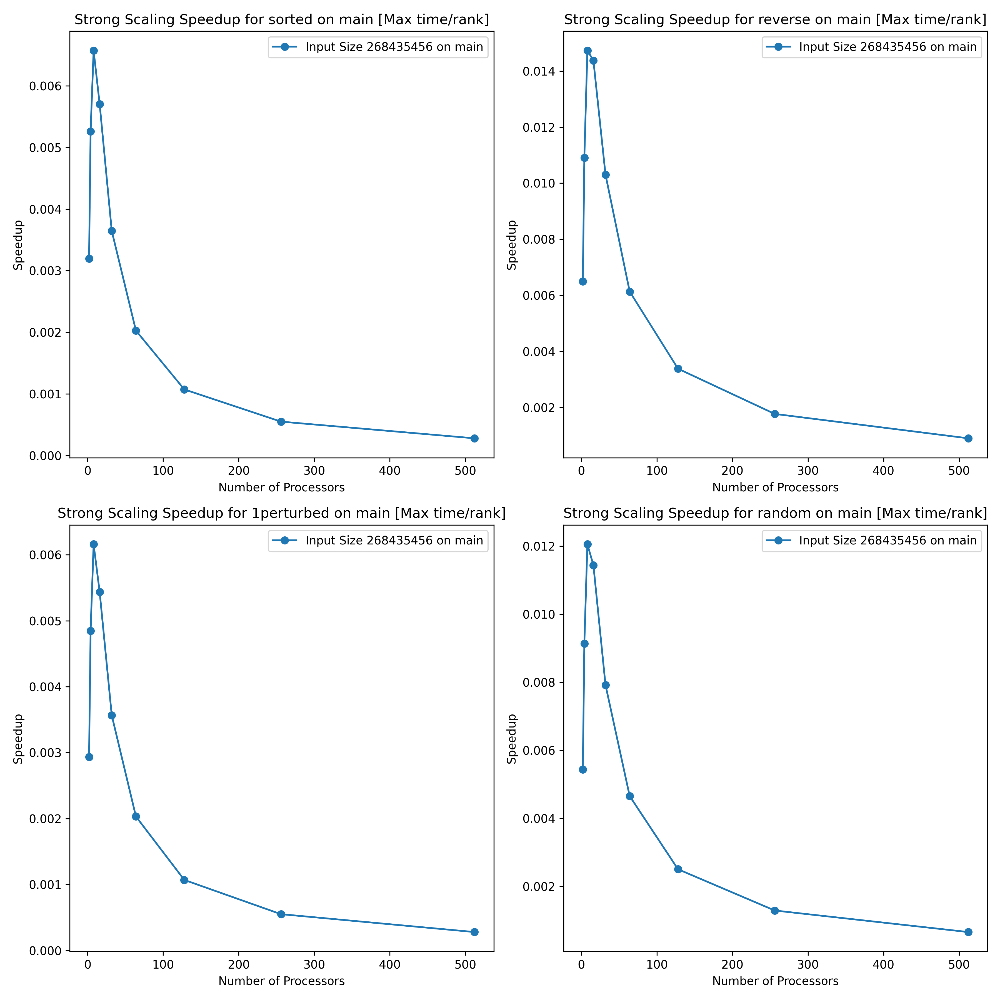

For the most part, all input types (sorted, reverse, random, and 1perturbed) follow the same trend of slowing down as the number of processors increases. This cannot be said about the 'comm' category, as the speedup seems to rise with the number of processors. This may be because all the MPI calls perform better with increased parallelism, where communication overhead is distributed more evenly across multiple processes, and certain collective communication operations (such as broadcast, scatter, and gather) become more efficient as the workload scales.

### Strong Scaling 

Max strong scaling on main
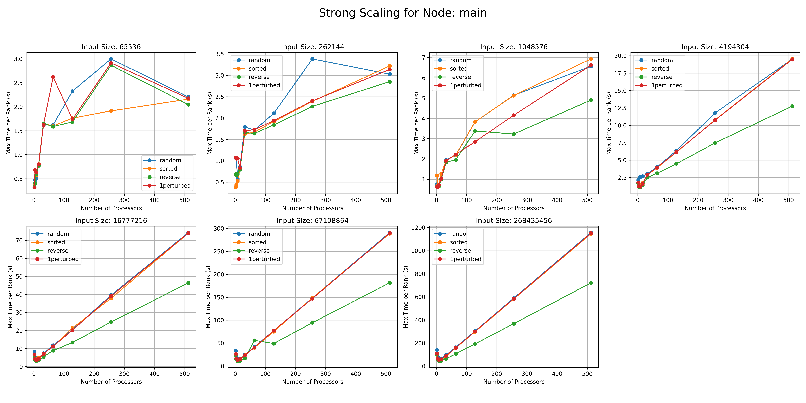

Max strong scaling on comp
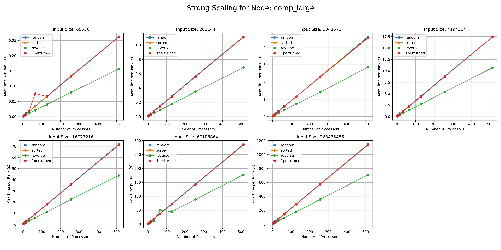

Max strong scaling on comm
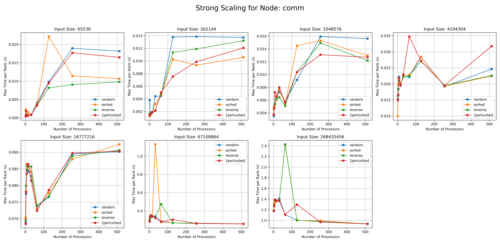

When performing strong scaling tests on my algorithm, both the 'main' and 'comp_large' portions of the CALI markings show an increase in their maximum time for all input sizes as the number of processors increases. This is expected, as more processors can introduce higher overhead from factors like increased synchronization or load imbalance in computational tasks. However, the 'comm' portion does not show a clear trend among the plots. This is because the maximum time for certain communication operations varies based on different input sizes and input types. In addition, communication patterns can change depending on the distribution of work, message sizes, and network contention, leading to varying results.

### Weak Scaling
Max Weak scaling on main
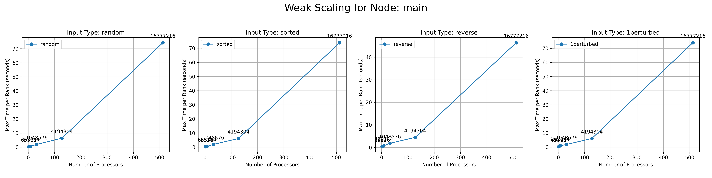

Max Weak scaling on comm
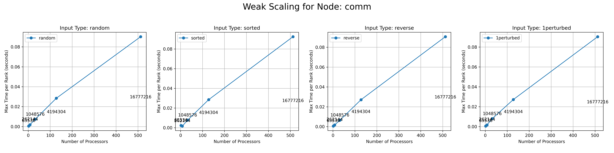

Max Weak scaling on comp
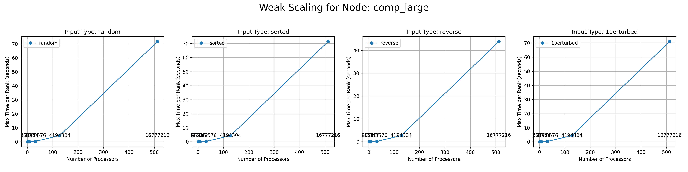

When simulating weak scaling tests on my algorithm, I noticed that all categories (main, comp_large, and comm) seem to follow the same trend of increasing max_time as the number of processors increases. This is because the problem size remains constant, and as the number of processors increases, a risk for bottlenecks may occur. These bottlenecks affect the “comm” portion of the algorithm because the volume of data to be exchanged within the network increases. This mostly affects the “merging arrays back to the master process” portion of the merge sort algorithm. 

### Radix Sort  
#### All requested graphs can be found in the Images/radix/... directory. Only the average cases are displayed below. Min/max/total/variance are located in the images directory. 
#### 1024 processes is not included as almost all attempts led to hydra memory errors. 
Average speedup on main
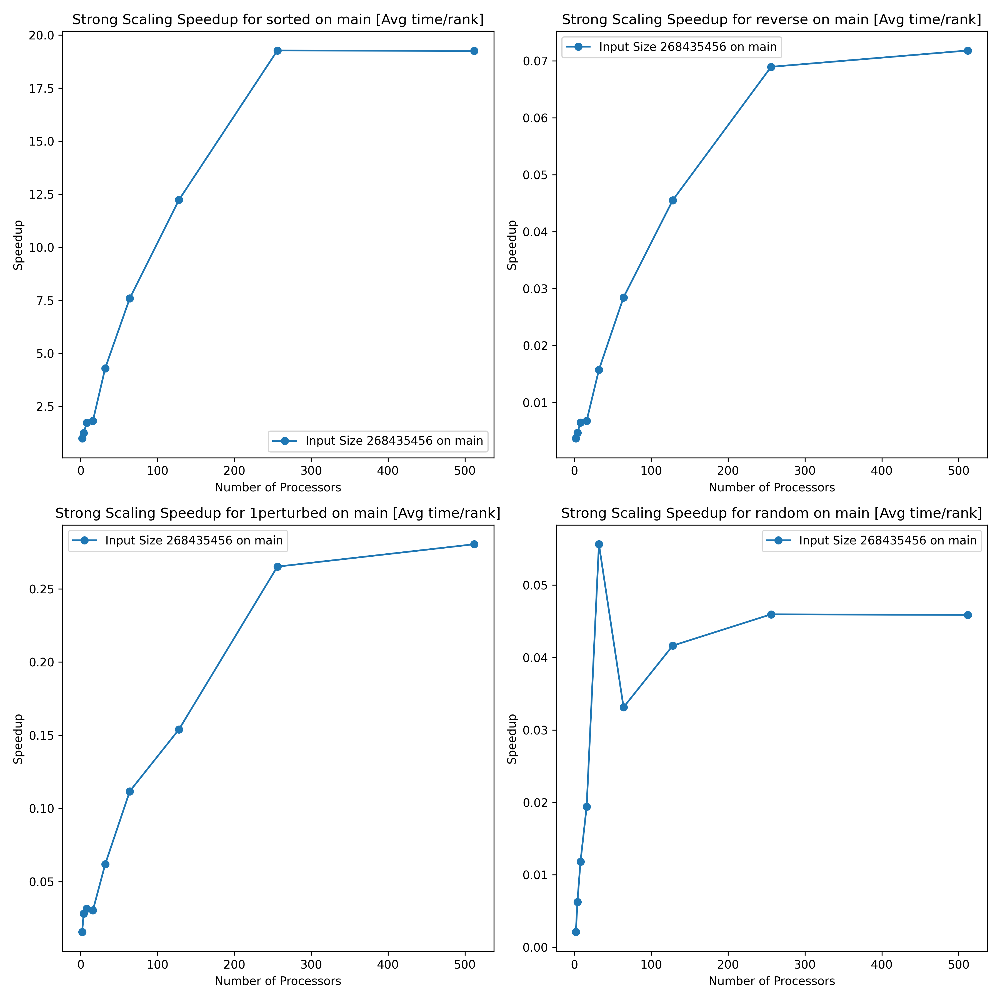

Average speedup on comm
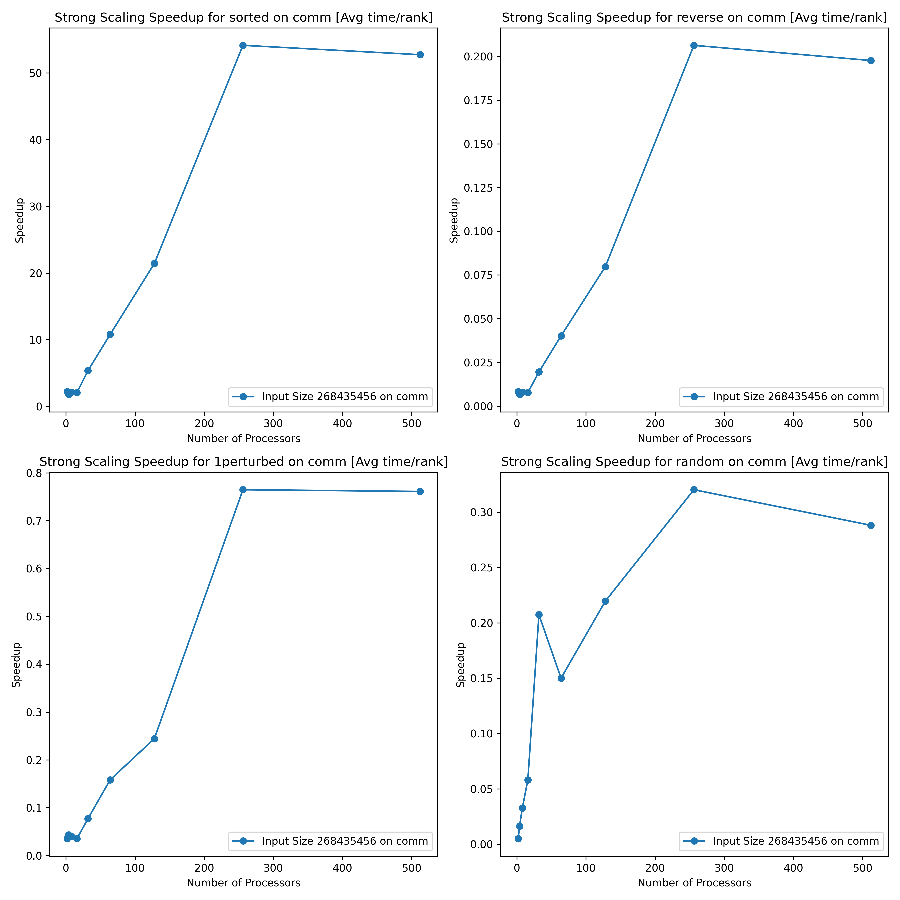

Average speedup on comp
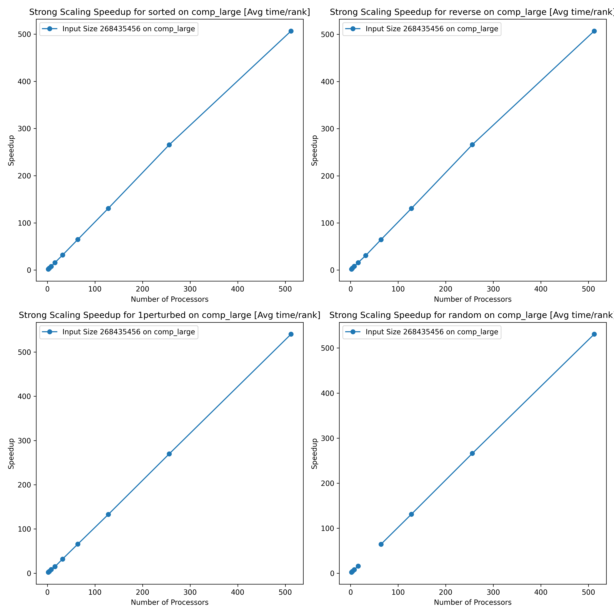

On average, the speedup is consistant and increasing for the computation. More process would be needed to potentially find a limit. Although the computation speedup is linear with increasing processes, the communication overhead increases significantly with more processes, leading to a stall in the overall speedup of the program as more processes are used for the array sizes tested.

Average Strong scaling on main
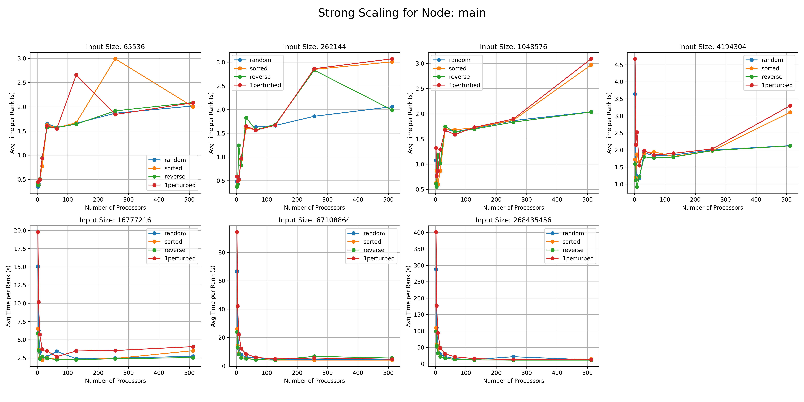

Average Strong scalingp on comm
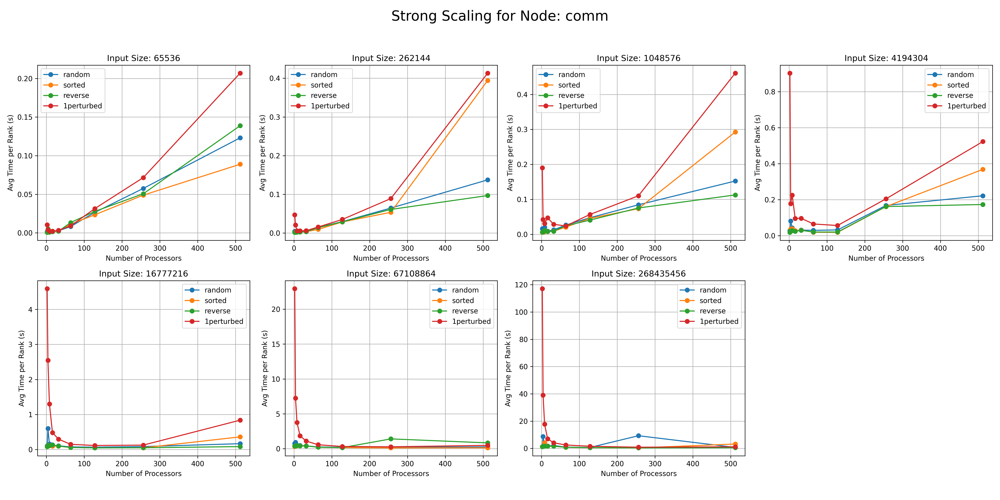

Average Strong scaling on comp
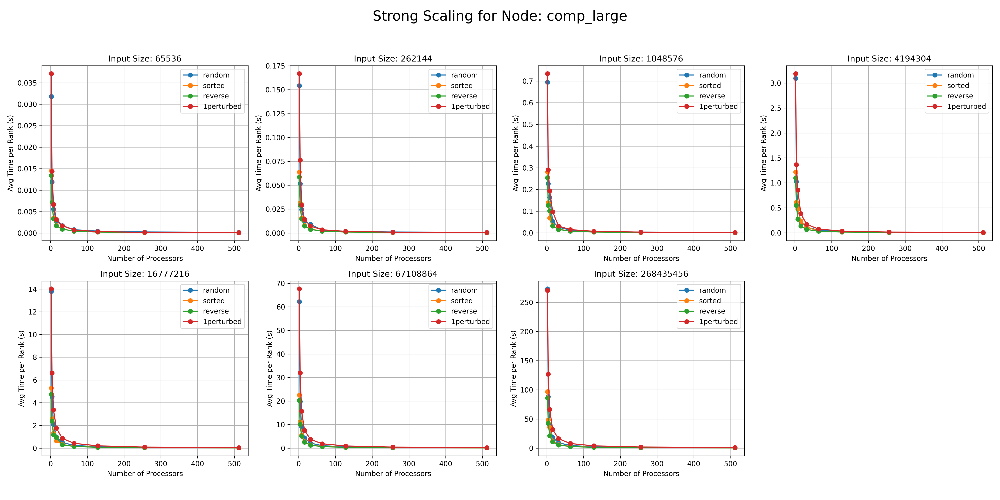

As depicted in the graphs, radix sort does scale strongly to a certian point. The algorythm does experiance massive gains if the array length is reasonably long compared to the number of processes available. One thing of note is that the average time per process increases significantly if there are too many processes for an array length. This is due to the increasing overhead that all the inter process communication requires. 


Average Weak scaling on main
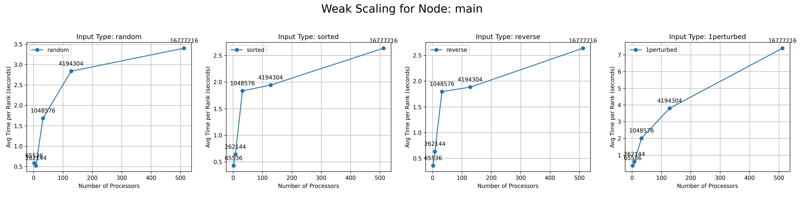

Average Weak scaling on comm
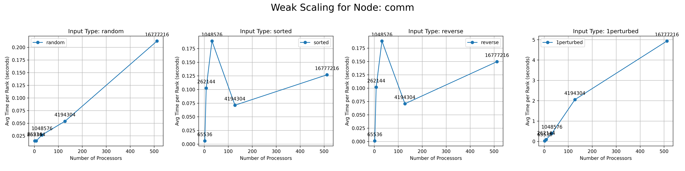

Average Weak scaling on comp
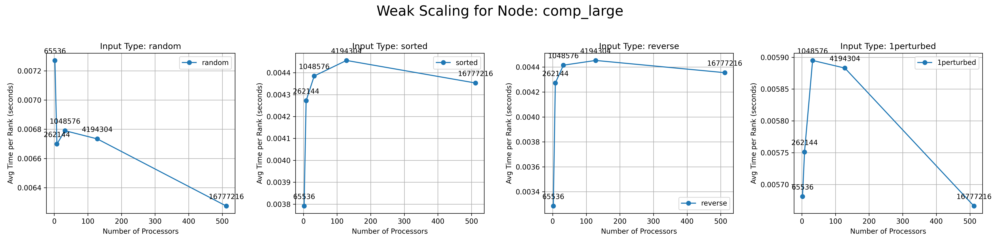

On average, the time per process increases with number of cores and array size. The communication time has some inconsistancy that is likely due factors outside of my control, such as notes being physicaly far apart or congestion on the network. 

## 5. Presentation
Plots for the presentation should be as follows:
- For each implementation:
    - For each of comp_large, comm, and main:
        - Strong scaling plots for each input_size with lines for input_type (7 plots - 4 lines each)
        - Strong scaling speedup plot for each input_type (4 plots)
        - Weak scaling plots for each input_type (4 plots)

Analyze these plots and choose a subset to present and explain in your presentation.

## 6. Final Report
Submit a zip named `TeamX.zip` where `X` is your team number. The zip should contain the following files:
- Algorithms: Directory of source code of your algorithms.
- Data: All `.cali` files used to generate the plots seperated by algorithm/implementation.
- Jupyter notebook: The Jupyter notebook(s) used to generate the plots for the report.
- Report.md
